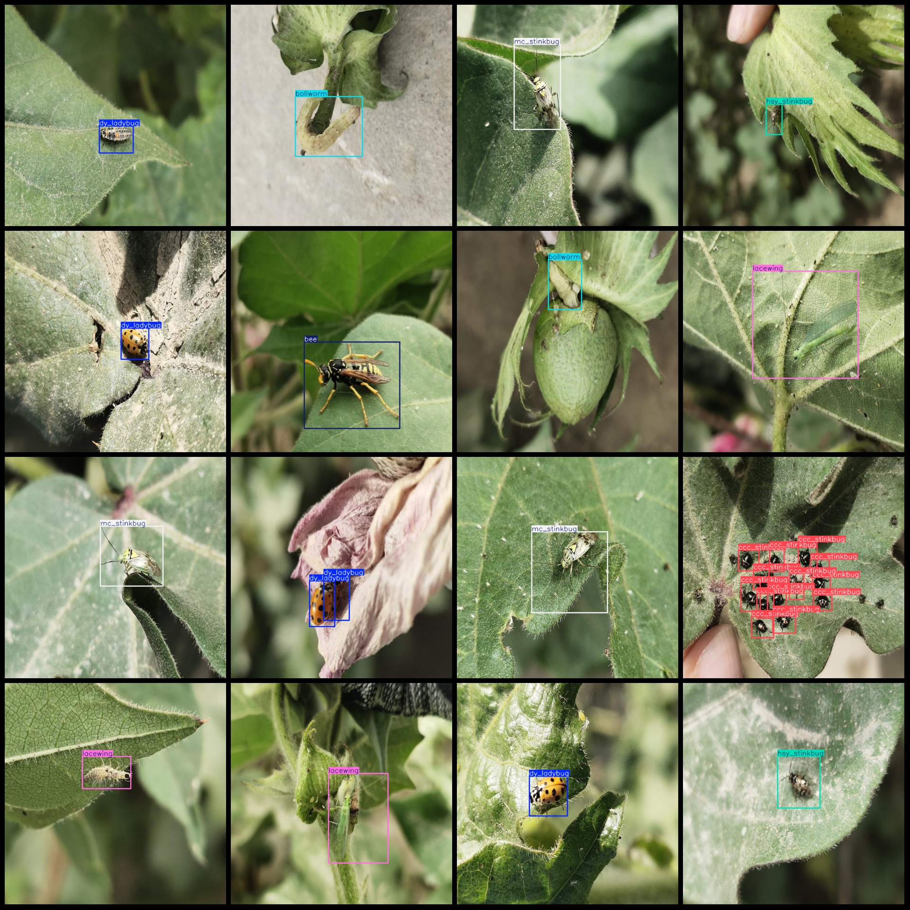
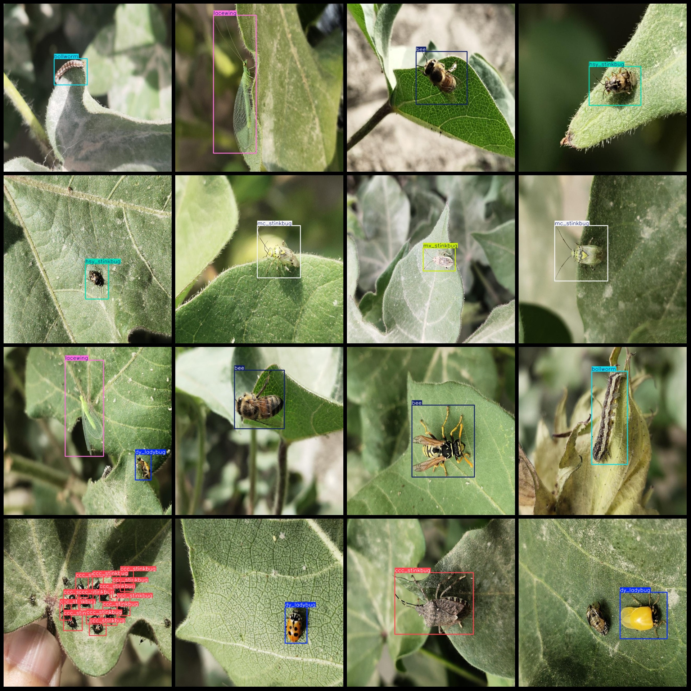

# Intelligent Agriculture Cotton Field Leaf Insects and Bollworm Detection Dataset VOC+YOLO with 3199 Images in 13 Categories

Dataset format: Pascal VOC format + YOLO format (without split path's txt file, only contains jpg image and corresponding VOC format xml file and yolo format txt file)
number of images: 3199  
annotation count: 3199  
annotation count: 3199  
annotationnumber of classes: 13  
["bee", "bollworm", "ccc_stinkbug", "dy_ladybug", "hb_ladybug", "hsy_stinkbug", "lacewing", "lbq_ladybug", "lv_stinkbug", "mc_stinkbug", "mx_stinkbug"]
"syrphid","zh_stinkbug_"]  
boxes per class:   
1. Bee Box Count = 161  
2. Bollworm Box Count = 534  
3. CCC Stinkbug Box Count = 217  
4. Dy Ladybug Box Count = 826  
5. Hb Ladybug Box Count = 161  
6. HSY Stinkbug Box Count = 309  
7. Lacewing Box Count = 390  
8. Lbq Ladybug Box Count = 164  
9. Lv Stinkbug Box Count = 13  
10. Mc Stinkbug Box Count = 473  
11. Mx Stinkbug Box Count = 120  
12. Syrphid Box Count = 49  
13. Zh Stinkbug Box Count = 17
total boxes: 3434  
images per class:   
Bee images = 161
Bollworm images = 534
CCC_Stinkbug images = 147
Dy Ladybug images = 727
HB Ladybug images = 161
HSY Stinkbug images = 306
Laewing images = 389
LBQ Ladybug images = 164
LV Stinkbug images = 13
MC Stinkbug images = 460
MX Stinkbug images = 120
Syrphid images = 48
Images: 17
image resolution: 640x640  
Use annotation tool: labelImg
Annotation rules: draw a rectangle around the class for annotation.
Important notes: The dataset does not have separate training, validation, and test sets. You need to divide them yourself.
Special statement: This dataset does not guarantee the accuracy of the trained model or weight file.
Image preview:
## Images

Here is a pay link on Stripe ( https://buy.stripe.com/3cs8yP7sY87d0vu9AB ). Please contact me lonlonago@foxmail.com after funding $89, and I will send you a complete data files , thank you!

